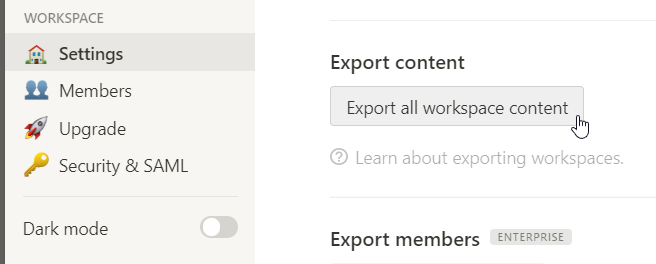
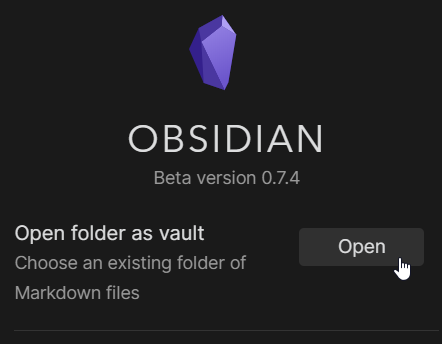

# Migrating from Notion to Obsidian
For those considering migrating content from [Notion](https://www.notion.so/) to [Obsidian](https://obsidian.md/), I've outlined detailed steps here that cover all the changes needed to make your export fully interlinked when opened as, or added to, an Obsidian vault.

At the bottom you can also find a GitHub link to a Python script I wrote based on these steps. It will do the conversion for you in mere seconds.

If you follow this guide, use some tools to batch process your conversion. I've suggested some inline based on working within the Windows OS. Other OS users will want to substitute the  suggestions for tools compatible on your system. [Alternativeto.net](https://alternativeto.net/) is a great resource to find what you need.

Aside from Notion comments. This guide will give you full internal link and backlink integration for your content in Obsidian.

# The Notion Export
Out of the box, the export files that Notion provides do not migrate to Obsidian very well. All external links will work, but:

- The hierarchical structure of your pages can only be navigated using Obsidian’s file explorer. 
- None of the internal navigation links work, which also means there won’t be any backlinks or connections in Obsidian's Graph View. 
- None of the content in your Notion tables will be viewable.  
- Embedded images also won’t show. 

All of this can be remedied by following the instructions below. Note however, that Notion comments do NOT appear to be included in their export files.

There will be five types of links in the exported files:

- External links which can be ignored, as they are in a compatible format
- User generated Internal Links
- Two types of Notion generated Internal Links
- And possibly some blank links that need correction

There may also be some *.csv* files that will need to be converted to *.md* files. 

Let's get started!

## Export Your Full Notion Database
1.  From your Notion app, click the **Settings & Members** tab in the sidebar  

2.  Find and click the **Settings** tab. Find the **Export content** section. Click the **Export all workspace content** button  

3.  Select **Markdown & CSV** as Export Format and click the **Export** button  

4.  Save the resulting .zip file to your computer
5.  Extract the .zip contents to a known location

# Remove the UID from all files and folders

All user-generated content will show a 32 digit alphanumeric Unique Identifier (UID) as a filename suffix.

They look like this:

`Meeting Notes 38f9b024692a4d0fbc14088d47c72d67`  

`Random Notes 49330b16a1f54b4d92b442b25ea986de.md`

We’ll want to remove these UIDs from all of your files and folders. Use a file renaming tool like [ReNamer](http://www.den4b.com/products/renamer) to remove the last 33 characters (UID + space) of every file and folder. The steps that follow are based on Renamer. Interpret them as needed for whatever app you're using.

## Trim the directory names first
1. Filter Settings > Add folders as files; Include subfolders 
2. Delete > Until > Delimiter = " " (space) > From right to left
3. From your zip extraction, drag the whole directory into app
4. Sort Decending by Path
(this prevents the issue of no longer finding subfolders after the parent folder is renamed)
5. Click **Preview**. Make sure things look good
6. Click **Rename**

## Trim the file names
1. Filter Settings > Add files within folders; Include subfolders 
1. Delete > Until > Delimiter = " " (space) > from right to left 
1. Drag whole directory in
1. Select all > Fix conflicting new names `Shift-F`
1. Click **Preview**. Make sure things look good
1. Click **Rename**

### Duplicate filenames
If there are multiple pages with the same name in the same directory, you'll have to combine or otherwise mitigate that content on your own at some point.

Notion differentiates notes with the UID which allows their users to work with multiple notes with the same filename. Since we can’t have multiple files with the same name in our operating system, a reasonable solution to this is to combine the contents of files having the same name within a common directory.

# Convert Notion Style Links to Obsidian Style Links
Any page in the export package may have links that need conversion to an Obsidian format. A good search and replace tool that’s capable of batch processing multiple files will make this work much easier. I’ve found [notepad++](https://notepad-plus-plus.org/) to be a great tool for this. Use whatever works for you. If you're familiar with Regex, this can make your batch processing even easier to manage. [Regexr](https://regexr.com/) is a great online tool to test and refine your regex.

## Process the .md Files

Your Notion export will contain *.md* files, *.csv* files, and may also contain image or other attachment files. The *.csv* files will eventually be converted to *.md* files. As a matter of organization simplicity, we'll process all the .md files first before introducing the *.csv* files.

### Convert Links to Obsidian Format 
There will be five types of links in the exported files to process. When exported from Notion, they are all in the same "inline" wiki link format. But they differ enough to confidently identify and batch process each type with your search and replace tools.

- `[link name](external.web/address)`
- `[link name](notion.so/username/page+UID)`
- `[link name](subfolder+UID)`
- `[link name](about:blank#subfolder/page)`
- `[link name]`

### External Links

Notion and Obsidian use the same format for external links. These links should be left alone. They look like this:

`[Link Name\](http://external.web.address)`

### User Generated Internal Links

These are links that the user had manually generated to tie notes together within Notion. They can be identified within your pages by the URL containing the notion domain and their username.

`[Link Name](https://notion.so/username/note_name+UID)`

We’re primarily interested in the note filename so that we can build complete link and backlink threads between our content. But there’s also enough information in these links to build pretty links, and also maintain a URL link to the original content on the Notion servers. Here, I’ll be including the source link as a footnote, should you ever need the original reference. I originally built these in so that if a link didn’t work in obsidian, we could still find our content easily. So far all links have worked but we can keep the links as a simple, unobtrusive safeguard.

Process Link Names:

1.  Isolate and save the {URL} portion
2.  Isolate and save the {Link Name} portion
3.  Isolate the {Note Name} portion to make it Obsidian friendly
4.  Search and replace any symbols in the {Note Name} to a space. **Only alphanumerics, underscores, and spaces** are retained in Notion exported filenames
5.  Remove any duplicate spaces and leading/trailing spaces from the {Note Name}
6.  Reconstruct Internal Links as pretty links with the source URL as a footnote
	1.  If {Link Name} is the same as {Note Name} 
`[[Note Name]] ^[URL]`
	2. If {Link Name} is different than {Note Name}  
`[[Note Name|Link Name]] ^[URL]`

#### Regex

This regex will capture what we need with the following groups:

`\[(.[^\[\]\(\)]*)\]\((https:\/\/www.notion.so\/(?:.[^\/]*)\/(.[^\[\]\(\)]*)-.[^\[\]\(\)]*)\)`

- Group 1: Pretty Link Title 
- Group 2: URL
- Group 3: target file name in web URL form (but not yet in Obsidian form) 

### Structural Links

Many of the connections between pages in Notion are inferred by hierarchy. When exporting this shows up as a directory structure. When using Notion, there’s no obvious visual difference between a directory and a page that you've created. Directories render as if it was a normal page.

Notion exports a representational *.md* file for these directories (that simply look like a page in Notion). This file will exist as a sidecar file alongside its respective directory. It will also have the same name as its respective directory. This sidecar *.md* file contains relative links to all the contents within the directory. Once processed, these will provide uninterrupted threads between all of your content in Obsidian!

Note that some directories will have a sidecar *.csv* file instead of a sidecar *.md* file. Notion exports these when a full-page database has been created and contains no other content blocks besides the Table, Board, List, or Gallery. See the CSV Conversion section below.

The relative links within these sidecar *.md* files are structured differently than user generated internal links. They each have their own line and follow this pattern:

`[Note Title](RelativePath+UID/filename+UID.fileExtension)`

For example:

`[Micronutrient Smoothie](Bodywork%20731fe478ea6048e1ac0df8c7f7ed95bf/Micronutrient%20Smoothie%2021e2b0c0922d46f387c8b353a17ff734.md)`

We want to preserve the relative path structure that these links contain. This helps mitigate the differences between how Notion and Obsidian deal with notes that have the same name.

Process the relative paths in each line, in this order:

1.  Remove the UIDs and the single leading URL space encoding (%20) in front of the UIDs
2.  Remove the file extension (*.md* or *.csv*)
3.  Search and replace the all remaining URL space encoding characters (%20) with a normal space character
4.  Remove parentheses
5.  Restructure the links into Obsidian Pretty Link format  

Example Results:

`[[Relative/Path/filename|Note Title]]`

`[[Bodywork/Micronutrient Smoothie|Micronutrient Smoothie]]`

#### Regex

This regex will capture what we need with the following groups:

`^\[(.+)\]\(([^\(]*)(?:\.md|\.csv)\)$`

- Group 1: Note Title
- Group 2: Relative Path and Filename

### Broken Links

There may be broken links within Notion. Often a broken link in Notion still has an associated file. It’s worth capturing and converting any broken links. These links are easily identified by the `about:blank\#` string where a `notion.io` URL should be. Here are a couple examples:

`[Evaluate on Tuesday](about:blank#Evaluate%20on%20Tuesday)`

`[2017-1-15 19:14](about:blank#2017-1-15%2019%3A14)`

Process the broken links:

1.  Remove the URL section in parentheses
2.  **Only alphanumerics, underscores, and spaces** are retained in Notion exported filenames. Convert all other symbols to a space
3.  Replace duplicate spaces with a single space
4.  Remove any leading or trailing spaces
5.  Frame the modified title in Obsidian double square brackets

Results:

`[[Evaluate on Tuesday]]`

`[[2017 1 15 19 14]]`

#### Regex

This regex will capture what we need with the following groups:

`\[(.[^\[\]\(\)]*)\]\(about:blank#.[^\[\]\(\)]*\)`

- Group 1: Note Title
- Group 2: Page name 
(these two match in all instances I've seen. So just process one or the other)

### Convert tags in lines starting with "Tags: "

Notion renders tags in the .md page exports on a single line starting with “Tags: ” near the top of a page.

Any words that follow will be separated with a comma.

`Tags: Routine, Structure`

Each of these words should be converted to the Obsidian tag format.

1.  Find all words after `Tags : `
2.  Prefix each of them with a hash `#`

Result:

`Tags: #Routine, #Structure`

#### Regex

This regex will find the list of tags as a captured group:

`^Tags:\s(.+)`

## Process the CSV files

Notion exports a CSV file for every Table, Board, List, or Gallery. The first column in each of these CSV files can be easily converted to an Internal Link for Obsidian.

### Delete all but the first column

Beyond the first Internal Link column, all the data in the following columns exist within the target file. Keeping the data here is liable to become a maintenance issue, as the additional data will not be mirrored between this table representation and the actual file content. Deleting all but the first column is suggested, but feel free to leave the redundant content if you don’t plan on changing the linked files or if there’s some other value.

### Modify Internal Links

Search and replace to modify the Internal Links in this order:

1.  If there's a web link in the title, and the link includes URL identifier (http, https, ftp). It must be removed because Notion exports these pages without the URL identifier in the filename.
2.  **Only alphanumerics, underscores, and spaces** are retained in Notion exported filenames. All other symbols need to be converted to a space.
3.  Replace duplicate spaces with a single space.
4.  Remove any leading spaces
5.  Notion cuts all filenames to a maximum of 50 characters. So cut the title to 50 characters if it’s longer.
6.  Finally, remove any trailing spaces.

Now that all the Internal Links match their respective file names, wrap each one in double square brackets to be an Obsidian Internal Link.

`[[filename one]]`

`[[filename two]]`

### Rename CSV to MD

Once the Internal Links have been converted in a Notion CSV file, change the file extension to *.md*. Again, [ReNamer](http://www.den4b.com/products/renamer) can be used to streamline this step once all the content has been corrected.

# Final Steps

Nice work! You’re finished. Time to import everything into Obsidian.

1.  Place all the converted files into a directory of your choosing
2.  Open Obsidian and click the Vault Icon 
3.  Select **Open folder as vault**  

4.  Use the Select Folder window to navigate to the directory with your newly converted files

Enjoy the shift to Obsidian!

# Notion-2-Obsidian Python script on GitHub
Find an automated Python script based on this outline in [my GitHub repository](https://github.com/visualcurrent/Notion-2-Obsidan) 

